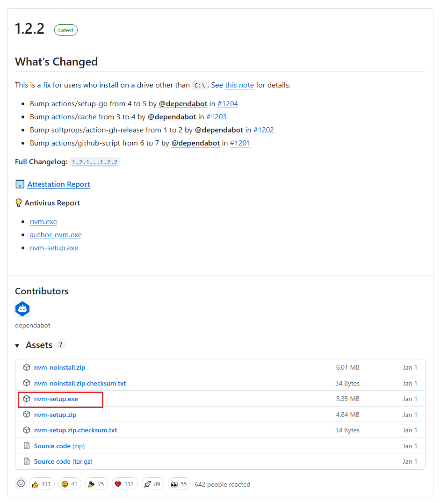
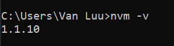
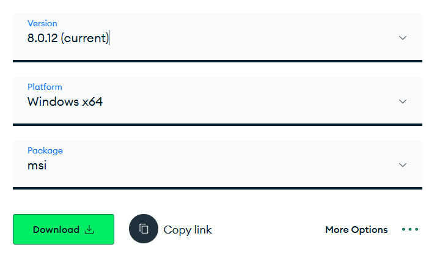
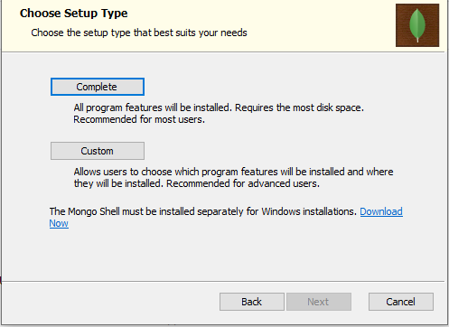
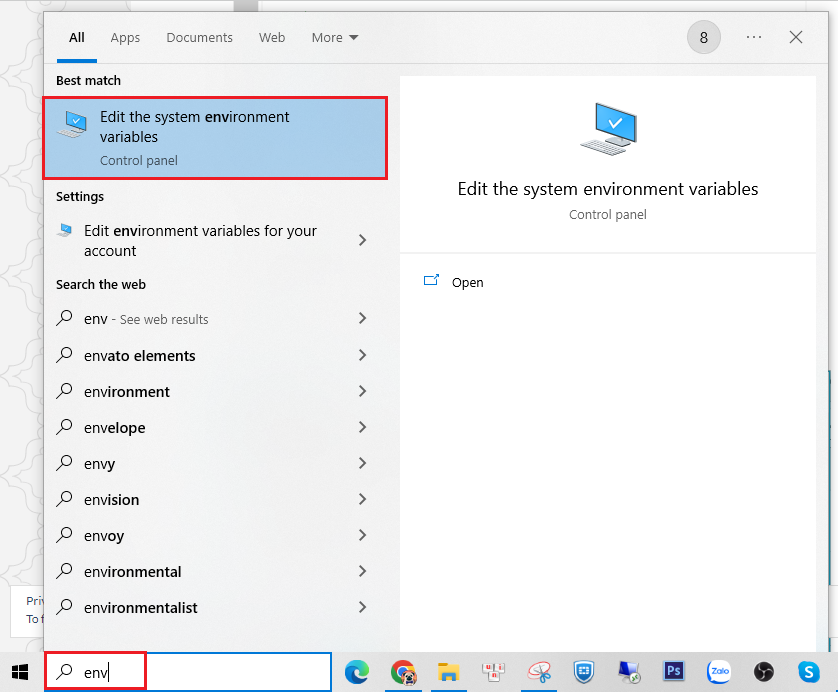
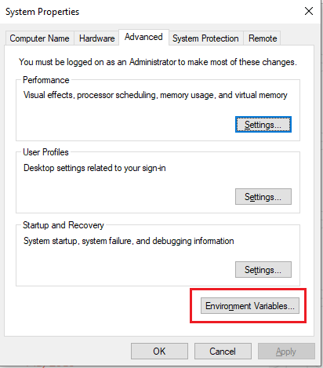
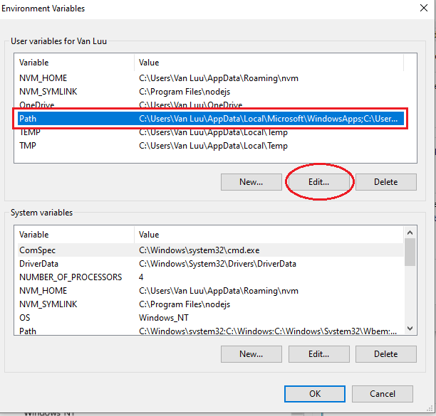
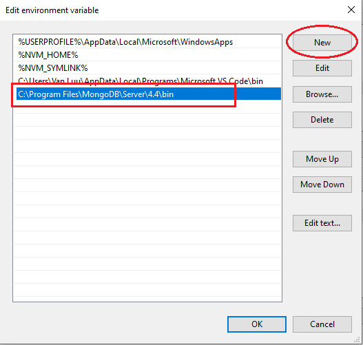
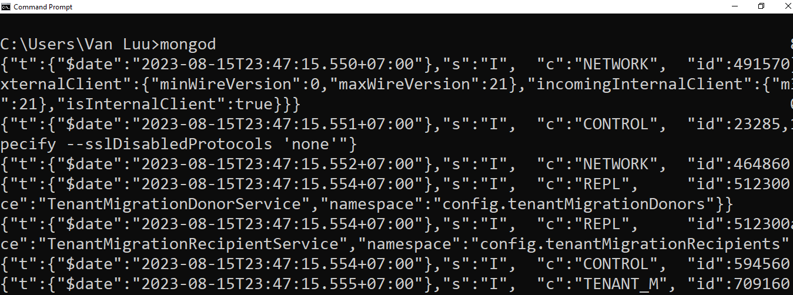

## 👨‍🔧 Installation

### 🧟‍♀️ NodeJS

1. Install NVM which allows you to manage and install multiple node versions on your computer. You can easily switch between node versions for each specific project you are working on. You can find the download page here https://github.com/coreybutler/nvm-windows/releases. At the latest section, click on `nvm-setup.exe` to download and then install it. You can download the latest version of `nvm` if the version you found on the page is higher than the version you see this guideline.

 <br />

2. Check the installation by opening the terminal and run the command `nvm -v`. If you installed the latest one, your command result might differ from mine.

 <br />

3. Install NodeJS via NVM (Node Version Manager) 

    ```
    nvm install 20.17.0
    nvm use 20.17.0
    ```

4. Check NodeJS installation `node -v`

### 🍃 MongoDB

* Download MongoDB - Visit this page https://www.mongodb.com/try/download/community-kubernetes-operator, just keep everything as default and download it.

 <br />

* After the download process is completed, let’s move on to install it. When you reach this step so clicking on the <b>Complete</b> button

 <br />

* Keep everything as default and <b>Next</b>, <b>Next</b> and <b>Next</b> and then <b>Install</b>

* After the install process is completed, it needs to be added to the Mongo’s bin folder to the <b>Path Environment Variable.</b>

* Find your Mongo’s bin folder, e.g. `C:\Program Files\MongoDB\Server\4.4\bin` and copy the path

* Press window key, type `env`, Windows will suggest <b>Edit the System Environment Variables</b>, click that

 <br />

* Click on <b>Environment Variables</b>

 <br />

* Select <b>Path</b> and click on <b>Edit</b> button

 <br />

* Click on the <b>New</b> button and paste your path `C:\Program Files\MongoDB\Server\4.4\bin` here and then click on the <b>OK</b> button at the bottom to close all the windows.

 <br />

* Check the configuration by opening your terminal and run the command `mongod`. If you can see the result as the screenshot below, the configuration is completed.

 <br />

If you completed all of the stuff above, yayyy congratulation 👏 Now, it’s time to move on 👻

## 💁 Usage
Run the Node server using this command
```
npm start
```
